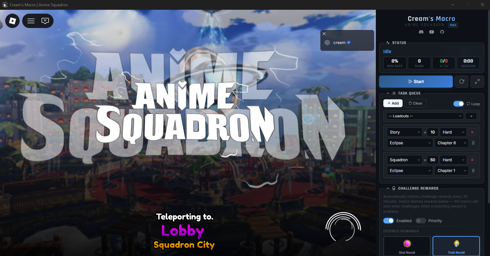

<p align="center">
  
</p>

<h1 align="center">Cream's Macro — Anime Squadron Auto Farm</h1>

<p align="center">
  <strong>Free auto-farming macro / bot for Roblox Anime Squadron</strong><br>
  Vision-based (screen capture + OpenCV) — no injection, no memory reading.<br>
  Built with Python, OpenCV, and pywebview.
</p>

<p align="center">
  <a href="https://github.com/Cweamy/Anime-Squadron-Creams-Macro/releases/latest">
    
  </a>
  <a href="https://github.com/Cweamy/Anime-Squadron-Creams-Macro/releases/latest">
    
  </a>
  <a href="https://github.com/Cweamy/Anime-Squadron-Creams-Macro/actions/workflows/build.yml">
    
  </a>
</p>

<p align="center">
  <a href="https://discord.gg/FwU6ppjKNf">Discord</a> · <a href="https://www.youtube.com/@Cweamya">YouTube</a> · <a href="https://github.com/Cweamy/Anime-Squadron-Creams-Macro/releases/latest">Download</a>
</p>

---

<p align="center">
  
</p>

Cream's Macro is a free Windows app that automates farming in **Anime Squadron** on Roblox — Story, Raid, Invasion, Squadron, Challenge, Event (Boros), and Infinite modes. Queue up tasks, hit Start, and let it grind gold, materials, and trait rerolls while you do something else. It works purely by *looking* at the screen (like a very fast player), not by touching the game's memory.

## Download & Install

No installer, no Python, no setup — just one `.exe`.

1. Open the [**Releases page**](https://github.com/Cweamy/Anime-Squadron-Creams-Macro/releases/latest)
2. The newest release is shown at the top
3. Under **Assets**, click the `.exe` file (e.g. `Anime Squadron Creams Macro.exe`) to download it
4. Double-click the downloaded file to run it — that's it

> Windows SmartScreen may warn about an unrecognized app the first time (normal for small open-source tools). Click **More info → Run anyway**, or build it yourself from source below.

On first launch, the macro asks permission before creating anything on disk — a `settings.json` file and a `Loadouts` folder, both placed next to the `.exe`. Decline and it still works, it just won't remember anything between sessions.

**Sharing it with someone (e.g. on Discord)?** The full exe is 40+ MB because of OpenCV/numpy, which is too big for most Discord uploads. Grab **`Anime Squadron Creams Macro Bootstrapper.exe`** from the same release instead — it's under 10 MB, and on first run it just downloads the real exe from this repo's Releases and launches it. Same install location, same behavior after that; it's just a lighter file to pass around.

## Features

- **Task Queue** — Queue multiple farming tasks with drag-and-drop reordering, removal, and looping support.
- **Quick Material Farm** — Pick a map (GT City, Marine Lobby, Ninja Village, Eclipse, or The Ice Continent) and click **Quick Material Farm**: it auto-builds 5 tasks (Story Chapters 2/4/6/8/10, Hard, ×15 each) and enables Loop — instant material farming, no manual queue building.
- **Loadouts** — Save your own custom loadouts, stack them with the **Append** dropdown, and use the built-in **Gold & Trait Farm** preset. Export any loadout to a `.json` file or import one shared by a friend.
- **Game Modes** — Challenge, Raid, Invasion, Squadron, Story, Event (Boros), and Infinite, with full stage/map/chapter/difficulty selection where applicable.
- **Raid Maps** — GT (Hidden Danger, Saiyan Hunt, Ruler Dragon, The Ultimate Evil) and Eclipse (Golden Age 1–3, The Eclipse).
- **Invasion** — The Lava Continent (Ashfall Continent, Infernal Landmass, Magma Rift, Scorched Horizon).
- **Squadron/Story Maps** — GT City, Marine Lobby, Ninja Village, Eclipse, plus The Ice Continent (Story) — up to 10 chapters (Story) or 4 chapters (Squadron).
- **Event (Boros)** — Fully vision-based: opens the event icon, presses Play and Find Match, then farms battles automatically. Replays on a win; leaves cleanly on a loss (no in-place replay after a loss in this mode) — and if a Retry/Replay button ever gets stuck on screen for 10 seconds without going away, it backs out via Leave instead of hammering a dead button.
- **Infinite Farming** — Presses Play, leaves to warp to a fixed spawn point, walks straight for ~6 seconds to reach the portal, then presses Play again to queue up. Rounds are picked and replayed normally after that, same as every other mode.
- **Challenge Reward Scanner** — Automatically checks challenge rewards every 30 minutes. Select desired rewards (Stat Reroll, Trait Reroll, Gem) and the macro farms them until the slot resets. Priority mode leaves the current battle instantly when rewards refresh. Toggling Enabled/Priority/rewards applies immediately, even mid-run — no need to stop and restart the queue.
- **Trait Farm Tracking** — Enable "Track Trait" per task to track daily trait drops for that stage (Aizen, Garou, Ghoul City, GT — The Ultimate Evil, Eclipse — The Eclipse). Each stage has its own daily limit (Garou caps at 30, Ghoul City at 20, others at 100); once hit, the task is skipped automatically and resets daily at 00:00 UTC.
- **Live Dashboard** — Win rate, run count, V/D stats, session timer, and task progress bar — all updating in real time.
- **Interactive Tutorial** — A built-in step-by-step "How to Use" walkthrough opens on first launch and can be reopened anytime via the **?** icon in the header.
- **Log Viewer** — Built-in live log feed for debugging.
- **Discord Webhooks** — Notifications with win/loss stats, battle time, task progress, session time, and optional screenshots (Roblox, fullscreen, or none).
- **Auto Reconnect** — Detects disconnects and crashes, automatically rejoins via deep link. If nothing on screen is recognized for 3 minutes straight (slow-but-working navigation doesn't count), it forces a rejoin anyway; after 3 such cycles it kills Roblox and relaunches it fresh.
- **Crash Resilience** — Full error tracebacks are logged and a Discord webhook fires (🛑 Macro Stopped — Error) if the macro ever hits an unexpected crash, instead of silently going idle with no explanation. A single bad task retries up to 3 times before the queue gives up, so one hiccup doesn't end an entire farming session.
- **Display Scale Warning** — Detects non-100% Windows display scaling (a common cause of Roblox docking at the wrong size) and shows a one-click button to jump straight to Display Settings.
- **Auto Update** — Checks GitHub Releases on startup with one-click update.
- **Docked UI** — Roblox docks directly into the macro panel for a clean single-window experience — no alt-tabbing.
- **Instant Stop** — Press `F2` or click Stop to halt immediately, even mid-battle.
- **Collapsible Panel** — Press `F4` to tuck the macro control panel away while Roblox keeps running full-size. All hotkeys are rebindable (and resettable) from the settings (gear) icon.

## Usage

> **New to the macro?** Click the **?** icon in the app header for a full interactive walkthrough — it also pops up automatically the first time you launch.

1. Download and run `Anime Squadron Creams Macro.exe`
2. The macro will wait for Roblox — click **Launch Game** or open Anime Squadron manually
3. Roblox docks into the macro window automatically
4. Add tasks to the queue — pick mode, map, chapter, difficulty, and repeat count (or use **Quick Material Farm** to build a queue in one click)
5. Click **Start** — the macro handles everything from there

### Game Modes

| Mode | Maps | Acts / Chapters |
|------|------|-----------------|
| **Raid** | GT, Eclipse | GT: Hidden Danger, Saiyan Hunt, Ruler Dragon, The Ultimate Evil · Eclipse: Golden Age 1–3, The Eclipse |
| **Invasion** | The Lava Continent | Ashfall Continent, Infernal Landmass, Magma Rift, Scorched Horizon |
| **Squadron** | GT City, Marine Lobby, Ninja Village, Eclipse | Chapter 1–4 |
| **Story** | GT City, Marine Lobby, Ninja Village, Eclipse, The Ice Continent | Chapter 1–10 |
| **Challenge** | Regular, Aizen, Garou, Ghoul City | Normal / Hard (Aizen, Garou & Ghoul City) — Ghoul City also has Chapter 1 / Chapter 2 |
| **Event (Boros)** | — | No map/chapter — just Play + Find Match |
| **Infinite** | — | No map/chapter — Play, warp, walk to the portal, Play |

Each task supports Normal or Hard difficulty and any repeat count (where applicable — Event and Infinite have no map/chapter/difficulty selection since they don't use the stage-select menu). Enable **Loop** to restart the queue after all tasks finish.

### Event (Boros) & Infinite Farming

Both of these skip the usual stage-select menu entirely and are handled purely by vision:

- **Event (Boros)** — finds the event icon in the lobby and opens it (this can take a moment since the icon animates), presses **Play**, then **Find Match**, and farms battles from there. A win replays normally; a loss clicks **Leave** instead of trying to replay, since Boros has no in-place replay after a loss — the next run just re-opens the event from scratch.
- **Infinite Farming** — presses **Play**, then **Leave** (this warps your character to a fixed spawn point), holds **W** for about 6 seconds to walk to the portal, then presses **Play** again to queue in. After that it picks rounds and replays normally like any other mode.

For both modes, if a Retry/Replay button ever gets stuck on screen for 10 seconds without disappearing, the macro clicks **Leave** instead of continuing to click a button that isn't doing anything — this applies to every mode, not just these two.

### Quick Material Farm

The fastest way to set up material farming in Anime Squadron:

1. In the Task Queue panel, pick a map from the dropdown next to the **Quick Material Farm** button (GT City, Marine Lobby, Ninja Village, Eclipse, or The Ice Continent)
2. Click **Quick Material Farm**
3. It generates 5 tasks automatically — Story mode, Chapters 2/4/6/8/10, Hard difficulty, ×15 repeats each — and turns on **Loop**

### Challenge Rewards

Select desired rewards under the Challenge Rewards section. When enabled:

- The macro checks the challenge tab every 30 minutes between runs
- If a desired reward (Stat Reroll, Trait Reroll, Gem) is found, it farms the challenge until the slot resets
- When the slot changes, it rechecks for desired rewards in the new slot
- **Priority mode** — leaves the current battle immediately when a reward refresh happens

Challenge battles are tracked separately and don't count toward your task progress.

### Loadouts

- **Gold & Trait Farm** (built-in preset) — GT City Ch.1 ×999 with Loop and trait reroll challenge checking
- **Custom loadouts** — save your current task queue under any name, and use the **Append** dropdown to stack multiple loadouts together. Each one is saved as its own `.json` file in a **Loadouts** folder next to the app, so you can back them up or find them on disk directly.
- **Export / Import** — the download/upload icons next to the loadout dropdown let you export the current task queue to a `.json` file (defaults to the Loadouts folder) or import one shared by a friend — great for sharing farming setups or backing them up

### Discord Webhook

1. Create a webhook in your Discord server (Server Settings → Integrations → Webhooks)
2. Copy the webhook URL
3. Click **Paste** in the macro's Webhook section

Each run sends an embed with mode, win rate, battle time, task progress, session time, and an optional screenshot. Supports silent mode (no notification ping).

### Hotkeys

| Key | Action |
|-----|--------|
| `F2` | Emergency stop |
| `F3` | Pause / Resume |
| `F4` | Collapse/restore the macro panel — Roblox stays visible and the macro keeps running (falls back to hide-to-tray if Roblox isn't docked yet) |

All hotkeys can be rebound from the gear icon in the header — each has a one-click **reset to default** button too.

## Building from Source

```bash
git clone https://github.com/Cweamy/Anime-Squadron-Creams-Macro.git
cd Anime-Squadron-Creams-Macro

pip install -r requirements.txt
pip install nuitka

# Generate embedded assets (only needed if you modify images in assets/)
python generate_assets.py

# Build exe
python build_nuitka.py
# Output: dist-nuitka/Anime Squadron Creams Macro.exe
```

### Requirements

- Python 3.10+
- Windows 10/11
- Dependencies: `pywebview`, `mss`, `opencv-python-headless`, `numpy`, `keyboard`, `requests`

## How It Works

Cream's Macro is **vision-based**: it uses **screen capture** (mss) and **template matching** (OpenCV) to detect UI elements in the Roblox window. It identifies the current scene (lobby, stage select, battle, results, etc.) and navigates through menus by clicking detected buttons. Victory/defeat is determined by HSV color sampling on the results screen.

There is **no memory reading, no injection, and no exploit code** — the macro only sees pixels and moves the mouse, the same way a player would. That doesn't make any automation risk-free, but it means this is a macro tool, not a cheat-engine-style script.

## License

This project is provided as-is for personal use.
